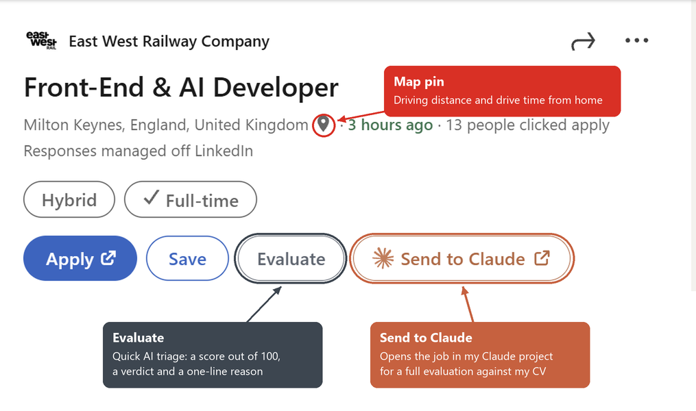
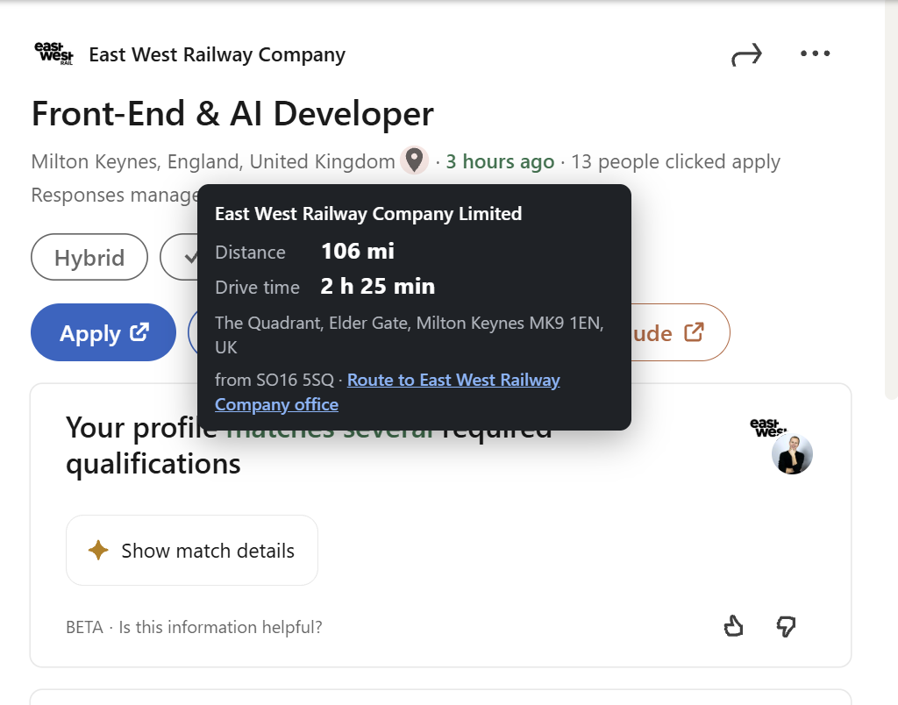
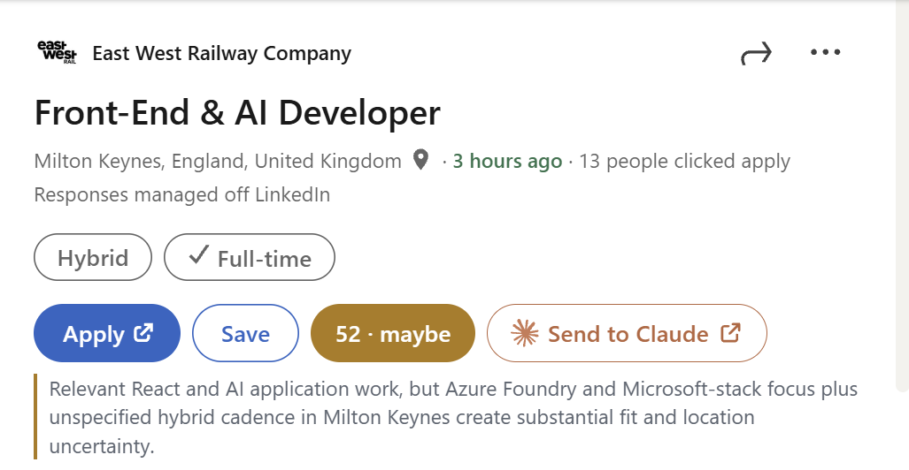

# LinkedIn Helper

A Chrome extension with helpers for the job you have open on LinkedIn. It adds a map pin after the location: hover or
click the pin to see the driving distance and drive time from your home postcode. Two buttons next to
Save triage the job: **Evaluate** gives a quick 0-100 fit score from a cheap model, and **Send to Claude**
opens the job as a new chat in a claude.ai project.

Personal-use tool, loaded unpacked. It is not published to the Chrome Web Store (see
[Why it is not published](#why-it-is-not-published)).

## What it does

- Adds a red pin after the location in the job detail pane, e.g. `Bolton, England, United Kingdom 📍`.
- Hovering shows a popover; clicking keeps it open until you click elsewhere or press Esc.
- The popover shows distance, drive time, where the route ends, and a link to the same route in Google Maps.
- Country-only locations (`United Kingdom`, `England, United Kingdom`, `United Kingdom (Remote)`) get no pin.
- Job cards in the results list get no pin; only the open job does.

- Adds an **Evaluate** button next to Save (see [Evaluate](#evaluate)).
- Adds a **Send to Claude** button after it (see [Send to Claude](#send-to-claude)).
- Adds a bar above the job list on search pages that scores the whole list (see
  [Scoring a whole list](#scoring-a-whole-list)).

## Install

1. Open `chrome://extensions` and turn on **Developer mode**.
2. Click **Load unpacked** and choose this folder.
3. Refresh any LinkedIn tab that was already open, then click a job.

After changing any file, click the reload button on the extension's card. Open LinkedIn tabs pick up the
new version by themselves; if a tab still misbehaves, refresh it.

## Settings

Click the extension's toolbar icon.

| Setting | Default | Notes |
| --- | --- | --- |
| Origin postcode (UK) | `SW1A 1AA` | Validated against postcodes.io on save. A bare outcode such as `SW1A` also works. |
| Distance units | Miles | Miles or kilometres. |
| Google Maps API key | empty | Optional; see below. Stored in `chrome.storage.local` on this machine only. |
| "Send to Claude" project URL | the JOBS EVALUATOR project | Any `https://claude.ai/` page with a message box, e.g. a project or `https://claude.ai/new`. |
| Send the message automatically | on | Off leaves the job in the message box for you to review and send. |
| OpenRouter API key | empty | Needed for Evaluate. Stored in `chrome.storage.local` on this machine only. |
| Evaluate model | `openai/gpt-6-luna` | Any OpenRouter model id. |

**Clear cache** removes stored lookups but keeps your settings and key.

## Two modes

### Free (no key)

- Routes to the **town centre** of the advertised location.
- Drive time has **no live traffic**.
- Uses postcodes.io, Nominatim (Photon as fallback) and the public OSRM server.

### With a Google Maps API key

- Looks up `Company, Town` with Places API (New). If a match is found within 60 km of the advertised
  town, the route ends at that **office address**, which the popover shows.
- Otherwise it routes to the town centre.
- Drive time comes from Routes API and is **traffic-aware**.
- If Google returns an error, the popover shows the free result plus Google's message in red.

Each job opened costs at most one Places call and one Routes call. Office lookups are cached for 30 days,
Google drive times for 12 hours, everything else for 30 days.

#### Getting a key

1. In [Google Cloud Console](https://console.cloud.google.com/), pick a project with billing linked.
2. **APIs & Services → Library**: enable **Places API (New)** and **Routes API**.
3. **APIs & Services → Credentials → Create credentials → API key**.
4. Edit the key: restrict it to those two APIs; leave application restrictions as **None**.
5. Optionally cap daily quota for both APIs under **Quotas**.
6. Paste the key into the extension popup and save. Never put it in this folder.

## Evaluate

A quick triage before the heavier Claude evaluation. Clicking **Evaluate** sends the same job text as
Send to Claude to a cheap model through [OpenRouter](https://openrouter.ai/), together with the prompt in
`triage-prompt.md`. The button then shows the result, e.g. `82 · yes`, coloured by verdict, with a
one-sentence reason on the line below:

| Score | Verdict |
| --- | --- |
| 85-100 | perfect |
| 70-84 | yes |
| 50-69 | maybe |
| 25-49 | no |
| 0-24 | definitely no |

- The verdict is derived from the score, so the two always agree.
- Results are remembered per job for 30 days and shown again when you reopen the job. Click the button to
  evaluate again; **Clear cache** forgets them all.
- With the default model a job costs about $0.0003 and takes about 3 seconds.

### Setup

1. Paste an OpenRouter API key into the extension popup and save.
2. Put the prompt in `triage-prompt.md` in this folder. It describes you and your criteria and must tell
   the model to return JSON with an integer `score` from 0 to 100 and a one-sentence `reason`. The file is git-ignored because it is
   personal; edits take effect on the next click, with no reload.

## Scoring a whole list

On job search pages a bar appears above the job list. **Start** opens every job in the list in turn and
scores it exactly as the Evaluate button would, from the full description; **Stop** pauses it.

- Each scored job gets its score and verdict under its title in the list, e.g. `58 · maybe`. Hover it
  for the reason.
- Jobs scoring under 45 are hidden from the list.
- The tiles count jobs per score range (`<45`, `45-60`, `61-70`, `71-80`, `81-90`, `91-100`) across every
  list page you opened in the last 24 hours, not just the current one.
- Click a tile to open a panel under the bar listing all of those jobs, best first, with company,
  location and the reason; each row opens the job in a new tab. The same click filters the current list
  to that range. Click the tile again, press Esc or use the panel's × to clear it. The `<45` tile shows
  the hidden jobs.
- The bar shows the job being processed and a progress count for the current list.
- With **Auto next page** ticked, the run clicks Next when a page is finished and carries on through the
  search results. Untick it at any time, even mid-run, and the run stops at the end of the current page.
- Scores are shared with the Evaluate button and kept for 30 days, so jobs scored before are not paid
  for again. **Clear cache** forgets them.

Each job is opened in the details pane so the complete posting is scored, which means LinkedIn marks
them as viewed and the pane steps through the list while it runs. When the run ends, the job that was
open before is opened again. A page of 25 jobs takes about a minute. Keep the tab in front while it
runs: LinkedIn does not load jobs in a background tab, so the run pauses until you come back.

## Applied and removed jobs

Two marks keep jobs you have dealt with out of the way. Both are remembered for 180 days and survive
**Clear cache**.

- **Applied:** you applied to the job.
- **Removed:** you looked at it and do not want to see it again.

Where to set them:

- On the open job, the line under the buttons has **✓ Mark as applied** and **✕ Remove from my lists**.
  Once marked, that line says so, with the date and an **Undo**.
- In the job list, every row has small **✓** and **✕** buttons next to its score.
- In the results panel, every row has the same two buttons.

Marked jobs disappear from the list and from the results panel, and a scoring run skips them. The bar
has an **Applied** and a **Removed** tile: click one to see those jobs again (in the list and in the
panel), where **Undo** or a second click on the button clears the mark.

When LinkedIn itself shows "Applied … ago" on a job, it is marked as applied automatically.

## Send to Claude

Clicking the button collects, from the open job:

- the top card down to the Apply/Save buttons: company, title, the location line, the "Promoted by" line,
  workplace type and job type;
- the whole **About the job** section.

It then opens the project URL, pastes the text into the message box and sends it. The first send opens
a new tab; later sends reuse that tab (starting a new chat in it) until you close it. You must
be signed in to claude.ai in the same Chrome profile. The text is held in `chrome.storage.session` for
that one tab and dropped after two minutes if the page never picks it up.

## How it works

| File | Role |
| --- | --- |
| `manifest.json` | Manifest V3 definition, host permissions for the lookup services. |
| `content.js` | Runs on linkedin.com. Finds the location line, inserts the pin, renders the popover. |
| `content.css` | Pin and popover styles. |
| `background.js` | Service worker. Does all network calls and caching; opens the Claude tab. |
| `triage-prompt.md` | Prompt for Evaluate. Git-ignored; create it yourself. |
| `bulk.js` | Runs on linkedin.com. The list-scoring bar, list scores and filters. |
| `claude.js` | Runs on claude.ai. Pastes a job sent from LinkedIn into the message box and sends it. |
| `options.html`, `options.js` | Settings popup. |
| `icons/` | Toolbar and store icons. |

### Finding the location line

LinkedIn's class names are obfuscated and change, so `content.js` does not rely on them. It looks for
text such as "2 days ago" or "25 applicants", climbs to the smallest element whose text contains `·`
separators, and takes the first segment as the location. Elements inside list cards, links, buttons and
navigation are skipped. A `MutationObserver` re-runs the scan as LinkedIn swaps jobs without a page load.

The company name comes from the nearest `/company/` link above the location line.

### Lookup flow

1. Origin postcode → coordinates (postcodes.io).
2. Job town → coordinates (Nominatim, UK first, then worldwide; Photon if Nominatim fails).
3. With a key: company office → coordinates (Places API), then route (Routes API).
4. Otherwise, or if Google fails: route from OSRM.

## Troubleshooting

- **No pin on a page that was already open:** refresh the tab; Chrome only injects extensions into pages
  loaded after install or reload.
- **"Extension was reloaded — refresh this page":** do that.
- **Red "Google: …" line:** the message is Google's. Usual causes are an API not enabled, billing not
  linked, or key restrictions not yet applied (allow 5 minutes).
- **No pin on any job:** LinkedIn has probably changed its page structure; the heuristics in
  `findByText` in `content.js` need adjusting.

- **Evaluate shows a red message:** hover the button for the full text. `triage-prompt.md is missing`
  and `Add an OpenRouter key in settings` say what to do; anything else is OpenRouter's own error.
- **No Evaluate or "Send to Claude" button:** the description or the top card was not found; adjust
  `findDescription` / `findTopCard` in `content.js`.
- **Claude tab opens but nothing is pasted or sent:** claude.ai has changed its message box; update the
  selectors at the top of `claude.js`.

## Why it is not published

- LinkedIn's User Agreement prohibits modifying the appearance of its site, which adding a pin does.
- The public Nominatim and OSRM servers are for light personal use, not for an app with many users.

## Data sources

Map data © OpenStreetMap contributors. Postcode data from postcodes.io. Optional office lookup and
traffic-aware routing from Google Maps Platform. Evaluate scores come from the chosen model via OpenRouter.
